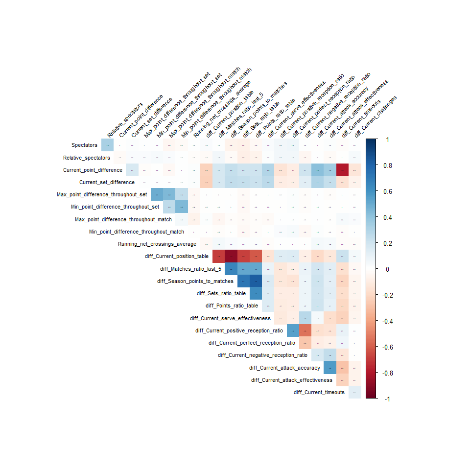
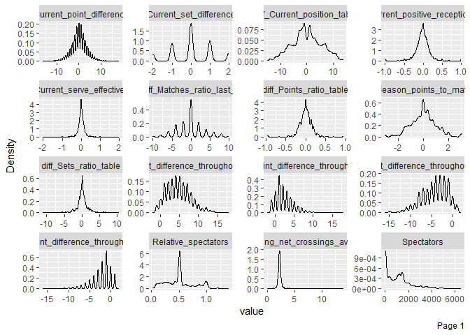
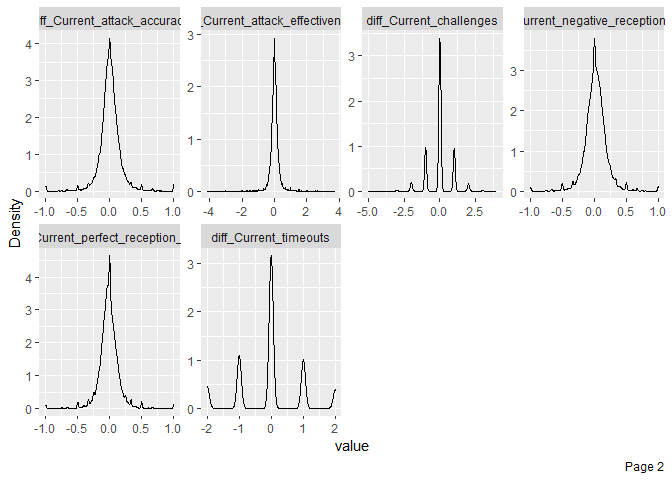
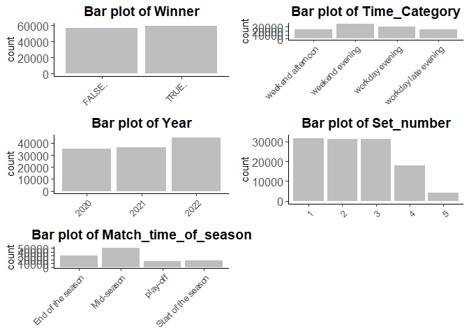
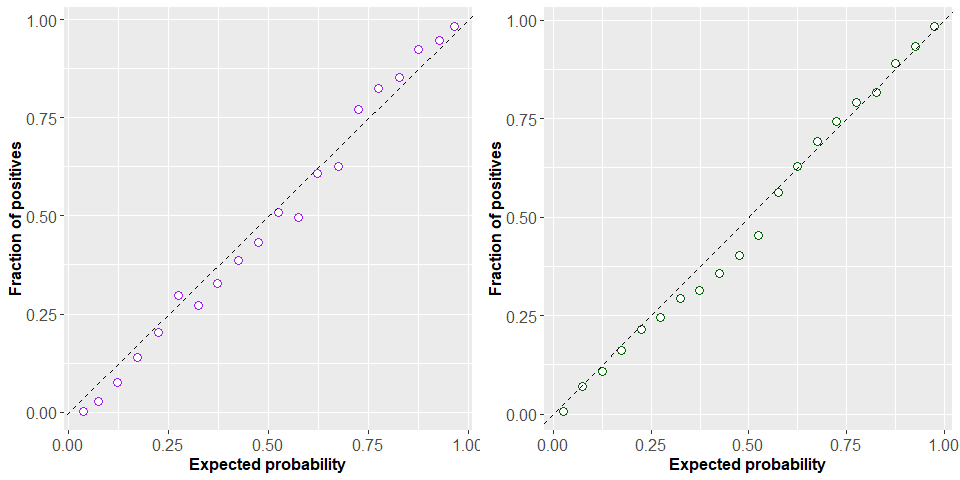
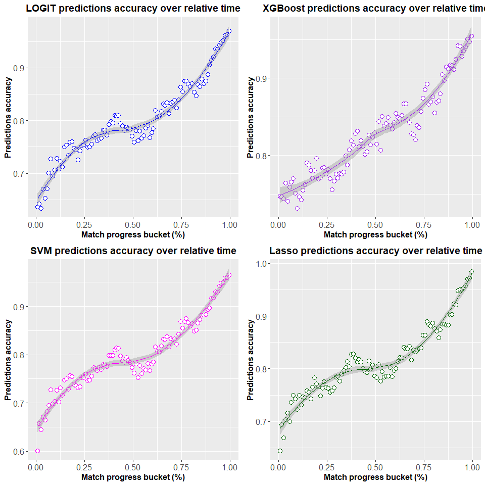
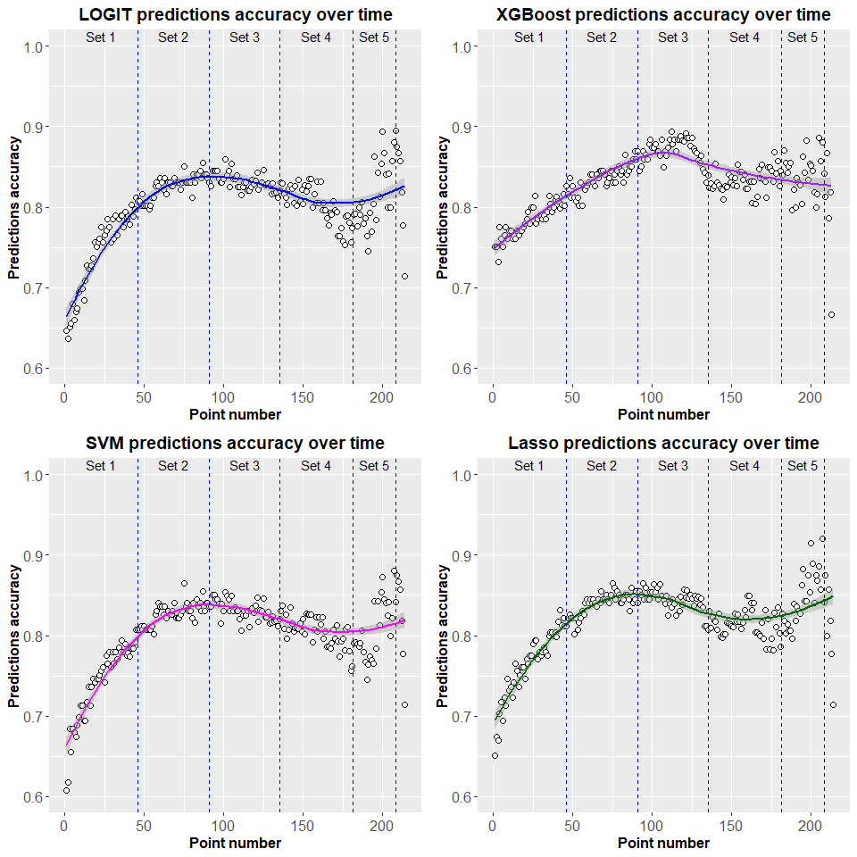

Building in-game prediction model for final result of volleyball match
================
Recap of Master Thesis research project defended in June 2023 at Faculty
of Economic Sciences, University of Warsaw. Research conducted by Jan
Dudzik
June, 2023

## Introduction

The sports analytics field has evolved profoundly within the past
decade, as a consequence of growth of applications of sophisticated
computational technologies and sports data becoming more accessible. One
of the primary goals of sports analytics is to predict future game
outcomes by leveraging data from past performances in order to produce a
competitive advantage for a team or individual. The discipline of
volleyball, being a part of the Summer Olympic Games from 1964, is a
sport with a substantial global audience and market share estimated to
reach 332.4 million USD by the year 2028 (Business Research Insights,
2023), displaying unique potential for appliance of analytics
techniques.

Volleyball teams, coaches, statisticians, and strategists could
significantly benefit from predictive analytics that would enhance
decision-making processes and strategic planning. Moreover, the betting
industry, spectators, and the sport development sector could derive
significant value from more accurate predictions of game outcomes. This
research aims to fill the existing gap by building a model generating
real time predictions of match outcome.

This research aims to assess several problems related to this innovative
method of predicting volleyball games outcome. Firstly, it is
hypothesized, that with inclusion of additional information about match
progress and current squads’ performance, the accuracy of predictions
increases throughout the course of the game. Secondly, the hypothesis of
existence of critical point in predictions, after which the model’s
performance decreases was addressed. To investigate these hypotheses,
the study employs a comprehensive set of both pre-match and in-game
variables to train multiple machine learning models. The pre-match
variables encapsulate the a priori historical performance of the teams,
while in-game variables capture the evolving dynamics of the match
state.

## Exploratory Data Analysis

Originally obtained dataset consisted of 116345 datapoints from 697
matches from years 2020-2023, and contained multiple columns, that
required cleaning and feature engineering. The data was webscrapped from
Plusliga.com website, as part of different project. Actions for data
cleaning, that were taken include:

1.  Replacing null values from *Spectators* and *Relative Spectators*
    columns with 0
2.  Converting all character columns to factors (except for MatchID)
3.  Converting decimal points from columns *Sets_ratio_table_host*,
    *Sets_ratio_table_guest*, *Points_ratio_table_host* and
    *Points_ratio_table_guest* from comma to dot.
4.  Grouping values from *Round* column into buckets. “play-off” and
    “play-out” values were grouped into “play-off” value, if *Round* was
    lower than 6, then “Start of the season” was picked, if those were
    between 7 and 19, “Mid-season” value was introduced, and in other
    case I assigned “End of the season”, creating column
    *Match_time_of_season*. This operation was conducted to limit the
    number of factor values in this column.
5.  All of the columns related to Host or Guest performance, were turned
    into difference between Host and Guest value. This operation was
    done to highlight which of the teams performed better at that time,
    and to reduce the number of variables and therefore limit the
    calculation time.

The dependent variale was *Winner*, taking value “TRUE” if the host team
won the game or “FALSE” otherwise. Above mentioned operations resulted
in final shape of the dataframe as presented below:

#### Pre-match variables:

- Year - The year that the match was played. Contains values between
  2020 and 2022, which denote the starting year of the season.
- diff_current_position_table - The difference between the position in
  the season standings table of the host and guest. A positive value
  denotes, that the host team held better position in the standings
  table before the match.
- diff_matches_ratio_last_5 - The difference between host’s and guest’s
  balances of won/lost matches across the last 5 games. A positive value
  denotes, that the host team had better balance of prior 5 games
  compared to guest team before the match. For games happening during
  initial 5 rounds, the existing balance of last matches was considered.
- diff_season_points_to_matches - The difference between the ratio of
  season points to played matches of the host and of the guest. In
  Plusliga if the team that won the match 3:0 or 3:1 is awarded 3
  points, while the losing team gets 0. In case of happening of
  tie-break, which is 5th set, the team winning 3:2 gets 2 points, while
  losing team receives 1. A positive value denotes, that host team
  scored more season points in relation to played matches, than guest
  before the match start.
- diff_Sets_ratio_table – The difference between the ratio of sets won
  to sets lost throughout the whole season for the host and for the
  guest. A positive value denotes, that host team had better won to lost
  sets ratio across the season, than guest, before the match start.
- diff_Points_ratio_table - The difference between the ratio of points
  won to points lost throughout the season for the host and for the
  guest. A positive value denotes, that host team had better won to lost
  points ratio across the season, than guest, before the match start.
- Time_Category - The categorical variable denoting if the game was held
  during a workday evening, workday late evening, weekend afternoon or
  weekend evening.
- Match_time_of_season - The categoric variable specifying the time of
  the season, based on the round number, bucketing records into four
  groups: Start of the season, Mid-season, End of the season and
  play-off.

#### In-game variables:

- Spectators - Number of people attending the game.
- Relative_spectators - Number of people attending the game divided by
  the stadium’s capacity.
- Set number - the number of set that the point was played in.
  Qualitative variable including values between 1 and 5.
- Running_net_crossings_average - the average number of times that the
  ball crossed the net and change of ball possession occurred. The
  variable is calculated as a running average in the window between
  start of the match and a current point.
- Current_set_difference – the difference between scored sets of the
  host and the guest, calculated for the time of a considered point.
- Current_point_difference - difference between scored points within the
  set, of the host and the guest, calculated for the time of a
  considered point.
- Max_point_difference_throughout_set – the largest value of the
  variable Current_point_difference, between the start of the match and
  a currently considered point.
- Max_point_difference_throughout_set – the largest value of the
  variable Current_point_difference, between the start of the set and a
  currently considered point.
- Min_point_difference_throughout_set – the lowest value of the variable
  Current_point_difference, between the start of the set and a currently
  considered point.
- Max_point_difference_throughout_match – the largest value of the
  variable Current_point_difference, between the start of the match and
  a currently considered point.
- Min_point_difference_throughout_match – the lowest value of the
  variable Current_point_difference, between the start of the match and
  a currently considered point.
- diff_Current_serve_effectiveness – Difference between serve
  effectiveness of host and guest, that were calculated from the
  beginning of match until currently considered point. Serve
  effectiveness is a measure used by Plusliga, identified as sum of
  serve aces, subtracted by number of serve errors, divided by number of
  all serves.
- diff_Current_positive_reception_ratio – Difference between positive
  reception ratio of host and guest, that were calculated from the
  beginning of match until currently considered point. Positive
  reception ratio is a measure used by Plusliga, identified as sum of
  serve receives classified as perfect or positive, divided by sum of
  all serve receives.
- diff_Current_perfect_reception_ratio - Difference between perfect
  reception ratio of host and guest, that were calculated from the
  beginning of match until currently considered point. Perfect reception
  ratio is a measure used by Plusliga, identified as sum of serve
  receives classified as perfect, divided by sum of all serve receives.
- diff_Current_negative_reception_ratio - Difference between negative
  reception ratio of host and guest, that were calculated from the
  beginning of match until currently considered point. Negative
  reception ratio is a measure identified as sum of serve receives
  classified as negative, Ball returned or receive error, divided by sum
  of all serve receives.
- diff_Current_attack_accuracy - Difference between attack accuracy of
  host and guest, that were calculated from the beginning of match until
  currently considered point. Attack accuracy is a measure used by
  Plusliga, identified as sum of hits that ended with point gained by
  hitter’s team, divided by all hits of this team.
- diff_Current_attack_effectiveness - Difference between attack
  effectiveness of host and guest, that were calculated from the
  beginning of match until currently considered point. Attack
  effectiveness is a measure used by Plusliga, identified as sum of hits
  that ended with point gained by hitter’s team, subtracted by all the
  hits that ended up with point gained by opposing team, divided by all
  the hits. Hits ending up with point gained by opposing team include
  hitting errors and hits succesfully blocked by the opposing team.
- diff_Current_timeouts – Difference between number of timeouts
  requested by host team and guest team, that were calculated from the
  beginning of match until currently considered point.
- diff_Current_challenges - Difference between number of referee’s
  decision challenges requested by host team and guest team, that were
  calculated from the beginning of match until currently considered
  point.

<!-- -->

<!-- --><!-- --><!-- -->

Above on can see the correlation plot between the variables, exposing
most of the variables to be not correlated. There is definitely a
positive correlation between variables denoting situation at table of
standings - variables denoting performance in last 5 matches, season
points, sets and point ratio, and negative correlation between those
values and diff_Current_position_table - which is understandable as the
bigger those values are, the smaller number denoting position in table
should be. One interesting relationship is diff_Current_timeouts and
Current_point_difference, pointing out, that losing teams take more
timeouts, which is aligned with the theory.

The charts depicting distributions of the numeric variables, present
mostly normal or leptocurtic distributions, making those variables
suitable for modelling. Some of the variables like
*Current_set_difference*, *diff_Current_challenges* or
*diff_Current_timeouts* could be turned into factors, as those take
small number of discrete values, although I wanted to avoid creating too
many dummy variables due to computation time limitations, and also those
variables are ordered and provide information also as numeric variables.
What is more, points difference variables have skewed distributions, and
therefore could potentially be transformed into logarithmic values, but
those changes didn’t improve the results by much, therefore for
simplicity, I decided to maintain current shape of these values.

The histograms of factor variables, present desired balance between
values of dependent variable, with slightly bigger number of TRUE
values, which could be interpreted by the theoretical effect of playing
match as a host, which improve odds of winning. This phenomenon was
addressed during train/test set division, by usage of stratified
sampling method. We can also see, that “Mid-season” value of
*Match_time_of_season* is quite overpopulated.

### Modelling

For modelling part, variety of machine learnings techniques were
selected. As a benchmark for comparison, I have decided to use the Logit
model mainly due to interpretability reasons. Additionally, I chose two
of the most prominent tree-based models, Random Forest (Breiman, 2001),
and eXtreme Gradient Boosting (Chen and Guestrin, 2016). These
algorithms are recognized for their aptitude in accurately discerning
intricate, latent interactions between variables. Furthermore, I chose
the Support Vector Machines (Cortes and Vapnik, 1995) model, which is a
more complex and computationally demanding model. The kernel function
was chosen to be linear, due to limited computational resources, and
cost parameter was set to 0.1 to avoid problem of overfitting, which
arose in early stages of training of both considered tree-based models.
In the selection, I have also incorporated the LASSO model (Tibshirani,
1996).

### Models comparison

|          Models           |   ECE   | Accuracy_test | difference |
|:-------------------------:|:-------:|:-------------:|:----------:|
|           Logit           | 0.02076 |    0.8006     |  -0.01098  |
|       Random Forest       | 0.0369  |     0.806     |  0.06199   |
| eXtreme Gradient Boosting | 0.03684 |    0.8294     |  0.008473  |
|  Support Vector Machines  | 0.01945 |    0.8001     |  -0.00789  |
|           Lasso           | 0.02029 |     0.816     |  -0.02764  |

The characteristics inherent to the problem of a binary classification
of volleyball matches pose a challenge in defining a singular, ideal
metric for evaluating model performance. Since our dataset presents a
balanced predicted variable, as each match appears only once, taking
into account both home and guest team perspectives, the classification
threshold is arbitrarily set at 0.5. Based on that information, one may
consider accuracy as a viable metric as it reflects the proportion of
correctly classified matches. However, the limitation of the accuracy
metric lies in its binary nature: predictions are exclusively deemed
correct or incorrect, with no consideration given to the magnitude of
the prediction error, an aspect which could bear significant relevance
in a betting context. An alternate measure worth considering is the
Expected Calibration Error (ECE) used by Guo et al. (2017). ECE groups
observations into probability bins and calculates the absolute
difference between the mean predicted probability within the bin and the
empirical probability of said bin. This difference is then weighted by
the proportion of all observations falling into each bin and summed into
single number. The primary advantage of ECE lies in its holistic
approach as it factors in not solely the correctness of a prediction,
but also the extent to which different probability levels align with
empirical ratios. Overfitting was a recurring issue during the training
of tree-based models. The difference between test and training sample
accuracy served as an indicator of this phenomenon and was rigorously
examined. Throughout the model training and selection processes, all
three aforementioned metrics were taken into consideration. The primary
aim during hyperparameter tuning was to maintain the accuracy
discrepancy between the training and test sets within 3% threshold,
followed by maximising accuracy and minimising ECE. As these metrics are
inherently incomparable, the decision-making process was arbitrary.

Finding the perfect measure for the volleyball match prediction model
isn’t straightforward due to the nature of binary classification
problems. As each match shows up only once from both teams’
perspectives, the data is fairly balanced, soI have set the
classification threshold at the level of 0.5. One could argue accuracy,
the rate of correctly predicted matches, is a suitable measure. However,
accuracy’s flaw is that it’s binary: it only counts predictions as right
or wrong without considering how off the error was, which could be
crucial in betting scenarios. Another potentially useful metric is the
Expected Calibration Error (ECE) by Guo et al. (2017). ECE bins
observations based on their predicted probabilities, calculates the
absolute difference between the mean predicted and actual probability in
each bin, weights these differences by the proportion of observations in
each bin, and adds them up. ECE’s strength lies in its comprehensive
approach, as it looks at not just the accuracy, but also how well
various probability levels match real-world rates. During the training
of tree-based models, overfitting was a common problem. This problem was
therefore monitored by including the gap between test and training
accuracy into models comparison.

All of the mentioned metrics were considered while training and
selecting models. During hyperparameter tuning, my main goal was to keep
the accuracy gap between training and test sets under a 3% threshold,
maximize accuracy, and minimize ECE. Since these metrics can’t really be
compared, I had to make the arbitrary decisions. The comparison shown in
the table above, reveals a similar performance across all the
techniques. Given that the difference in accuracy between the train and
test samples is comparable for all models except the Random Forest, I’m
disregarding this model in my further analysis and focusing on other
metrics. When it comes to the Expected Calibration Error, the LOGIT,
SVM, and Lasso models perform similarly, with errors hovering around the
2% mark. For accuracy, the XGB model stands out, achieving 0.829 on the
test sample, closely followed by the Lasso model at 0.816. Since my goal
was to both maximize accuracy and minimize the ECE metric, I’ll be
considering both the XGB and Lasso models in my ongoing analysis.

Underneath one could see the model fit to various probability buckets,
which is source to Expected Calibration Error calculation for the two
considered models. Both the eXtreme Gradient Boosting and Lasso models
perform well on the Calibration Plots.The first model shows a consistent
trend of overestimating the winning probability for team 1 until around
0.7, after which it starts to underestimate it. This model seems to
favor the underdog in its predictions. On the other hand, the Lasso
algorithm handles extreme cases well, but it tends to underestimate
predictions for mid-range probabilities, favoring the home team’s
chances. While this could be an issue, only 12.5% of records fall into
the four categories where the difference between the predicted and
actual probabilities is over 5 percentage points. This could explain why
the model doesn’t focus too much on this part of the distribution.

<!-- -->

## Hypotheses testing

    ## `geom_smooth()` using method = 'loess' and formula = 'y ~ x'
    ## `geom_smooth()` using method = 'loess' and formula = 'y ~ x'
    ## `geom_smooth()` using method = 'loess' and formula = 'y ~ x'
    ## `geom_smooth()` using method = 'loess' and formula = 'y ~ x'

<!-- -->

Charts above show how accuracy changes over relative time intervals for
the chosen models, testing the hypothesis about information gain
throughout the game. I assigned each observation a point number,
counting from the start of each game, and normalized it by dividing the
obtained number by the max point number for that game. This gave me a
column showing the percentage progress of the match. I then grouped
these values into 100 buckets, and calculated the accuracy for each
bucket, adding trend lines for visualization clarity.

All models show a similar trend of increasing accuracy over time, though
the growth slows down around the match’s midpoint. Looking at each
bucket of the Logit, SVM, and Lasso models separately, there’s a small
drop in accuracy in the middle period. However, a smoothing line shows a
steady upward trend in accuracy. The eXtreme Gradient Boosting model
stands out with its slower growth trajectory, and only slight changes
around the midpoint. This anomaly around the match’s middle suggests
it’s a crucial period where the game’s outcome often changes. Even
though there aren’t theoretical explanations for these shifts, the
predicted odds suggest the middle phase is a time of heightened
uncertainty. The eXtreme Gradient Boosting model’s smoother increase in
accuracy implies it might rely more on long-term situation variables,
while other models seem more affected by short-term changes. A visual
comparison of the models’ smoothing lines shows the XGB model outdoing
the others in prediction accuracy for about the first 80% of the match
progress. Even though there’s a slowdown in accuracy growth at a certain
point in each model, instances of decreased accuracy are negligible.
Based on these graphs, it’s clear that prediction accuracy does indeed
improve as the game goes on.

    ## `geom_smooth()` using method = 'loess' and formula = 'y ~ x'
    ## `geom_smooth()` using method = 'loess' and formula = 'y ~ x'
    ## `geom_smooth()` using method = 'loess' and formula = 'y ~ x'
    ## `geom_smooth()` using method = 'loess' and formula = 'y ~ x'

<!-- -->

Set of charts above show how four models perform throughout absolute
time, tracking their accuracy throughout a match, measured in point
numbers. I’ve added trend lines to the scatterplot for easier analysis,
and five vertical lines to mark the average end point of each set. The
LOGIT, SVM, and Lasso models follow a similar hyperbolic pattern,
peaking between the second and third set before declining and then
rebounding near the end of the fourth set. The XGB model, on the other
hand, shows a linear growth from the start to the middle of the third
set, followed by a steady decline. A comparison of the models’ smoothing
lines reveals a shift in the critical point between the Logit, SVM, and
Lasso models and the XGBoost model. The XGBoost model reaches this point
later, achieving higher accuracy than the Lasso model at its peak.
Despite the timing differences, the graph demonstrates a key transition
in all models where prediction accuracy starts to fall as the match
progresses.

The turning point in prediction accuracy may be due to the varying
length of volleyball matches. Only 394 of the 697 matches in the dataset
went beyond 3 games, and just 157 lasted for 5 sets. This could inflate
the accuracy in the third set area of the graphs, due to games nearing
their end with a clear winner. As the total points progress, matches
that have ended are excluded, so after the 135th point, the average end
of the third set, only 73.2% of the test dataset was included. After the
182nd point, the average end of the fourth set, only 36.8% of the
observations were included, mostly matches tied at two sets each with no
clear winner. I believe the turning point in prediction accuracy happens
because from the third set on, the number of considered games decreases,
and the share of tied games, expected to end later, increases. This
suggests that there’s a point in the match when bookmakers could stop
accepting in-game bets as the odds predicted with high accuracy decline.
Identifying this point could help bookmakers reduce potential losses by
not accepting further bets once predictability drops. This gives
bookmakers a new way to manage in-game bets effectively and align their
operations with their best interests.

## Conclusions

The point-by-point prediction approach has proven its effectiveness
across various sports, both individual and team-based. It’s reasonable
to expect the same level of efficacy when applied to volleyball matches,
an assumption I’ve examined in depth in this research. I considered
information from 697 matches spanning from 2020-2023, obtained from the
Plusliga website. After conducting an exploratory data analysis and
transforming the data, the resulting dataset was divided into training
and testing samples. These were then used to train and compare five
machine learning algorithms. From the data, I scrutinized two
hypotheses:

1.  Prediction accuracy continuously improves with the relative progress
    of the game.
2.  There’s a specific point in the match after which the accuracy of
    predictions tends to decrease.

Through comprehensive graphical analyses, utilizing trend lines, both
hypotheses were substantiated. These analyses demonstrated the constant
growth of prediction accuracy in terms of relative match time and the
existence of an inflection point in prediction accuracy for absolute
time. Possible extensions of this analysis could include broadening the
dataset to encompass individual player statistics, including basic
information about them, their match and seasonal form, and the current
squad for each point. This approach could improve prediction accuracy by
accounting for exceptional individual performances. Other valuable
variables could include significant player injuries, tactical
substitutions during matches, the history of previous encounters between
teams, and the distance between the teams’ home cities.In the context of
model selection, I could improve the analysis by examining correlations
between neighboring points, an aspect overlooked in this study as each
observation was treated independently. Exploring potential point series
or relationships between individual points could also yield valuable
insights. The changing dynamics of match situations could be captured by
applying Neural Network architectures like Long-Short Term Memory
models. This study explores an innovative approach to predicting in-game
odds for volleyball match outcomes, using the Polish men’s professional
volleyball league, Plusliga, as a case study. Given that research in
this field is less developed compared to sports analytics research for
more popular sports like American Football, Basketball, and Tennis,
there’s significant potential for further work. As demonstrated in this
research, machine learning techniques are well-suited for analyzing
volleyball matches.

## Bibliography

- Breiman, L. (2001). Random forests. Machine learning, 45, 5-32.
- Chen, T., & Guestrin, C. (2016). Xgboost: A scalable tree boosting
  system. In Proceedings of the 22nd acm sigkdd international conference
  on knowledge discovery and data mining (pp. 785-794).
- Cortes, C., & Vapnik, V. (1995). Support-vector networks. Machine
  learning, 20, 273-297.
- Guo, C., Pleiss, G., Sun, Y., & Weinberger, K. Q. (2017). On
  calibration of modern neural networks. In International conference on
  machine learning (pp. 1321-1330). PMLR.
- Tibshirani, R. (1996). Regression shrinkage and selection via the
  lasso. Journal of the Royal Statistical Society: Series B
  (Methodological), 58(1), 267-288.
